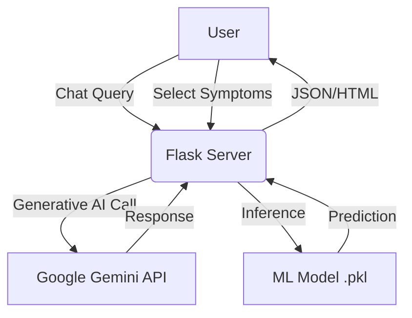

# 🩺 MedOrbit - AI-Powered Health Assistant

**MedOrbit** is a hybrid AI healthcare platform designed to provide accessible medical guidance. It combines **Supervised Machine Learning** for precise disease prediction with **Generative AI (Google Gemini)** for an interactive medical chatbot. The platform also features real-time emergency services and hospital geolocation.

---

## 🚀 Live Demo

**[Click here to view the Live Website](https://medorbit-health.onrender.com/)** *(Note: Since this is hosted on a free instance, please allow 30-50 seconds for the server to wake up on the first visit.)*

---

## 🌟 Key Features

### 1. 🤖 AI Medical Chatbot (GenAI)

* Powered by **Google Gemini 2.5 Flash**.
* Provides instant, natural language answers to health-related queries (e.g., *"What should I eat if I have the flu?"*).
* Maintains conversation context for follow-up questions.

### 2. 🔍 Symptom Analyzer (Machine Learning)

* Uses a custom-trained **Scikit-Learn model** (Decision Tree/Random Forest).
* Predicts potential diseases based on user-selected symptoms (e.g., *Fever + Rash + Headache → Dengue*).
* Trained on a dataset of over 40 common diseases and 130+ symptoms.

### 3. 🆘 Emergency SOS System

* A dedicated, pulsing **Emergency Button** accessible from the navigation bar.
* Instantly dials **112** (Universal Emergency Number) on mobile devices.
* Designed for quick access in critical situations.

### 4. 🏥 Hospital Locator

* Integrated feature to find nearby hospitals and clinics based on the user's current location.

### 5. 🔐 User Authentication

* Secure Login and Registration system using Flask-Login.
* Personalized dashboard for every user.

---

## 🛠️ Tech Stack

| Component | Technology Used |
| --- | --- |
| **Backend** | Python, Flask |
| **Frontend** | HTML5, CSS3, Bootstrap 5, JavaScript |
| **Machine Learning** | Scikit-Learn, Pandas, NumPy |
| **Generative AI** | Google Gemini API (Generative AI SDK) |
| **Database** | SQLite (Local) / PostgreSQL (Production) |
| **Deployment** | Render (Cloud Platform), Gunicorn |
| **Version Control** | Git, GitHub |

---

## 🏗️ Architecture

MedOrbit uses a hybrid architecture to handle different types of user requests:

1. **Chat Requests:** Routed to Google's Gemini API for generative text responses.
2. **Prediction Requests:** Processed locally by the Flask server using the pre-trained `.pkl` model.
3. **Emergency/Location:** Handled client-side via browser APIs for immediate response.



---

## 💻 Installation & Setup

Follow these steps to run the project locally on your machine.

### Prerequisites

* Python 3.8 or higher installed.
* A Google Cloud API Key for Gemini.

### Steps

1. **Clone the Repository**
```bash
git clone https://github.com/Shaunfernandez7788/medorbit-app.git
cd medorbit-app

```


2. **Create a Virtual Environment**
```bash
python -m venv venv
source venv/bin/activate  # On Windows use: venv\Scripts\activate

```


3. **Install Dependencies**
```bash
pip install -r requirements.txt

```


4. **Set Up Environment Variables**
Create a `.env` file or export your API key:
```bash
export GEMINI_API_KEY="your_api_key_here"

```


*(Or simply paste your key into `app.py` for local testing)*
5. **Run the Application**
```bash
python app.py

```


6. **Access the App**
Open your browser and go to: `http://127.0.0.1:5000`

---

## 🔮 Future Enhancements

* **Voice Support:** Allowing users to speak directly to the AI assistant.
* **Appointment Booking:** Integration with local doctors for scheduling.
* **Medication Reminders:** Push notifications for medicine schedules.
* **Profile History:** Saving past diagnoses and chat history for user reference.

---

## 👨‍💻 Author

**Shaun Anselm Fernandez**

* *Computer Science Engineering Student*
* *Cambridge Institute of Technology, Bangalore*
* [LinkedIn Profile](https://www.google.com/search?q=https://linkedin.com/in/shaun-anselm-fernandez) (Add your actual link)
* [GitHub Profile](https://www.google.com/search?q=https://github.com/Shaunfernandez7788)

---

### 📝 License

This project is licensed under the MIT License - see the LICENSE file for details.
