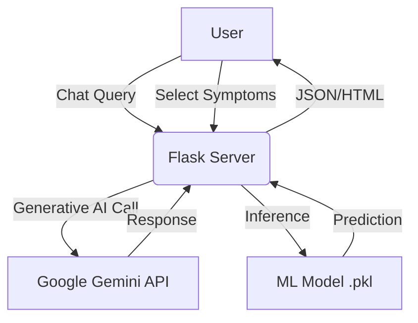

# 🩺 MedOrbit - AI-Powered Health Assistant


**MedOrbit** is a hybrid AI healthcare platform designed to provide accessible medical guidance. It combines **Supervised Machine Learning** for precise disease prediction with **Generative AI (Google Gemini)** for an interactive medical chatbot. The platform also features real-time emergency services and hospital geolocation.

---

## 🚀 Live Demo

**[Click here to visit MedOrbit Live](https://medorbit-health.onrender.com/)**

> **Note:** The application is hosted on a free Render instance. Please allow **30-50 seconds** for the server to wake up on the first visit.

---

## 🌟 Key Features

### 1. 🤖 AI Medical Chatbot (GenAI)
* **Smart Model Discovery:** Automatically detects and connects to the best available **Google Gemini 1.5 Flash** model.
* **Context-Aware:** Provides instant, natural language answers to health-related queries (e.g., *"What home remedies work for a sore throat?"*).
* **Persona-Based:** Engineered to respond with empathy and clarity, acting as a supportive medical assistant.

### 2. 🔍 Symptom Analyzer (Machine Learning)
* **Algorithm:** Custom-trained **Random Forest Classifier** using Scikit-Learn.
* **Function:** Predicts potential diseases based on user-selected symptoms (e.g., *High Fever + Joint Pain + Rash → Chikungunya*).
* **Dataset:** Trained on a verified medical dataset covering 40+ common diseases and 130+ distinct symptoms.

### 3. 🆘 Emergency SOS System
* Dedicated **SOS Button** accessible globally from the navigation bar.
* Instantly dials **112** (Universal Emergency Number) on mobile devices for immediate help.

### 4. 🏥 Hospital Locator
* Integrated geolocation feature that finds nearby hospitals and clinics based on the user's current coordinates.

### 5. 🔐 Secure User Dashboard
* Complete authentication system (Login/Register) using **Flask-Login**.
* Secure password hashing with **Werkzeug Security**.

---

## 🛠️ Tech Stack

| Component | Technology Used |
| :--- | :--- |
| **Backend** | Python, Flask, Gunicorn |
| **Frontend** | HTML5, CSS3, Bootstrap 5, JavaScript |
| **Machine Learning** | Scikit-Learn, Pandas, NumPy, Joblib |
| **Generative AI** | Google Gemini API (`google-generativeai`) |
| **Database** | SQLite (Development) / SQLAlchemy ORM |
| **Deployment** | Render Cloud Platform |
| **Version Control** | Git, GitHub |

---

## 🏗️ Architecture

MedOrbit uses a hybrid architecture to handle different types of user requests efficiently:

1.  **Chat Requests:** Routed securely to Google's Gemini API via server-side API calls.
2.  **Prediction Requests:** Processed locally by the Flask server using the pre-trained `.pkl` model (Low latency).
3.  **Emergency/Location:** Handled client-side via browser APIs for immediate response.



---

## 💻 Installation & Setup

Follow these steps to run the project locally on your machine.

### Prerequisites

* Python 3.9 or higher installed.
* A valid [Google AI Studio API Key](https://aistudio.google.com/app/apikey).

### Steps

1. **Clone the Repository**
```bash
git clone [https://github.com/Shaunfernandez7788/medorbit-app.git](https://github.com/Shaunfernandez7788/medorbit-app.git)
cd medorbit-app

```


2. **Create a Virtual Environment**
```bash
python -m venv venv
# On Windows:
venv\Scripts\activate
# On Mac/Linux:
source venv/bin/activate

```


3. **Install Dependencies**
```bash
pip install -r requirements.txt

```


4. **Set Up Environment Variables**
* Create a file named `.env` in the root folder.
* Add your API key inside it:
```env
GEMINI_API_KEY=your_actual_api_key_here

```


*(Note: The `.env` file is hidden and secure. Do not share it publicly.)*
5. **Run the Application**
```bash
python app.py

```


6. **Access the App**
Open your browser and go to: `http://127.0.0.1:5000`

---

## 🔮 Future Enhancements

* **🎙️ Voice Support:** Enabling speech-to-text for hands-free symptom description.
* **📅 Appointment Booking:** Integration with local doctor APIs for scheduling.
* **💊 Medication Reminders:** Push notifications for medicine schedules via email/SMS.
* **📂 Profile History:** Saving past diagnoses and chat history for long-term health tracking.

---

## 👨‍💻 Author

**Shaun Anselm Fernandez**

* *Computer Science Engineering Student*
* *Cambridge Institute of Technology, Bangalore*

---

### 📝 License

This project is licensed under the MIT License - see the [LICENSE](https://www.google.com/search?q=LICENSE) file for details.

```
```
* [LinkedIn Profile](https://www.linkedin.com/in/shaun-fernandez7878)
* [GitHub Profile](https://github.com/Shaunfernandez7788)
